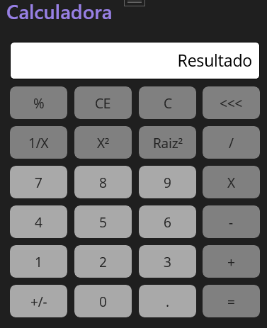

# Calculadora Padrão

> Aplicação desenvolvida utilizando C#, uma linguagem frequentemente utilizada no mercado de trabalho, através do .NET MAUI onde ocorre integração do código fonte com sistemas operacionais do Windows, MAC, Android e IOS.

O foco do projeto é desenvolver um aplicativo que simule uma calculadora funcional, utilizando Grid Layout, além de um code-behind bem desenvolvido para cada funcionalidade e usabilidade da calculadora.

## Meta

Gabriel C. Martins – gacmartins@gmail.com

[Meu perfil do Github](https://github.com/Gabriel-Dev-C/)

## Contributing

1. Fork it (<https://github.com/Gabriel-Dev-C/Calculadora-Maui/fork>)
2. Create your feature branch (`git checkout -b feature/fooBar`)
3. Commit your changes (`git commit -am 'Add some fooBar'`)
4. Push to the branch (`git push origin feature/fooBar`)
5. Create a new Pull Request
